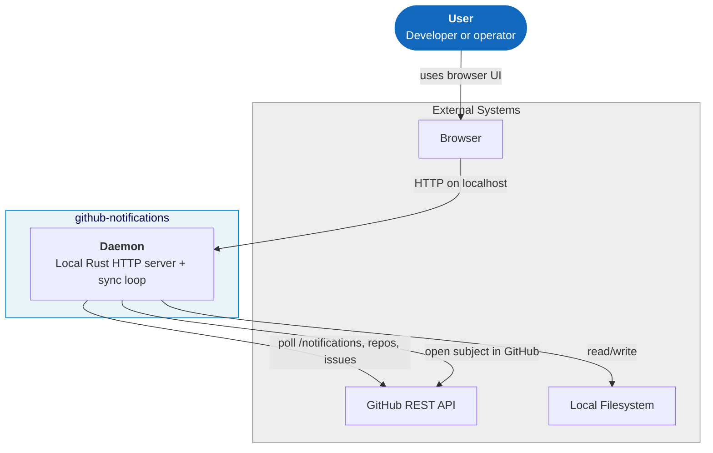
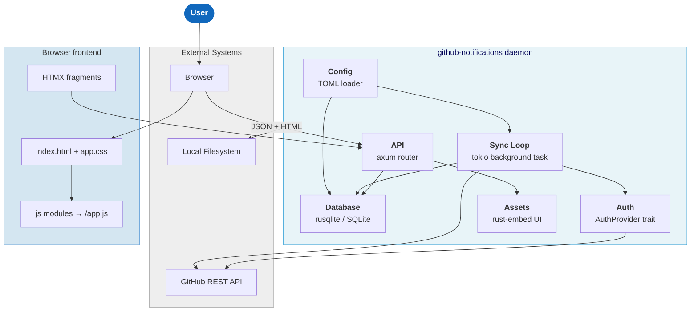
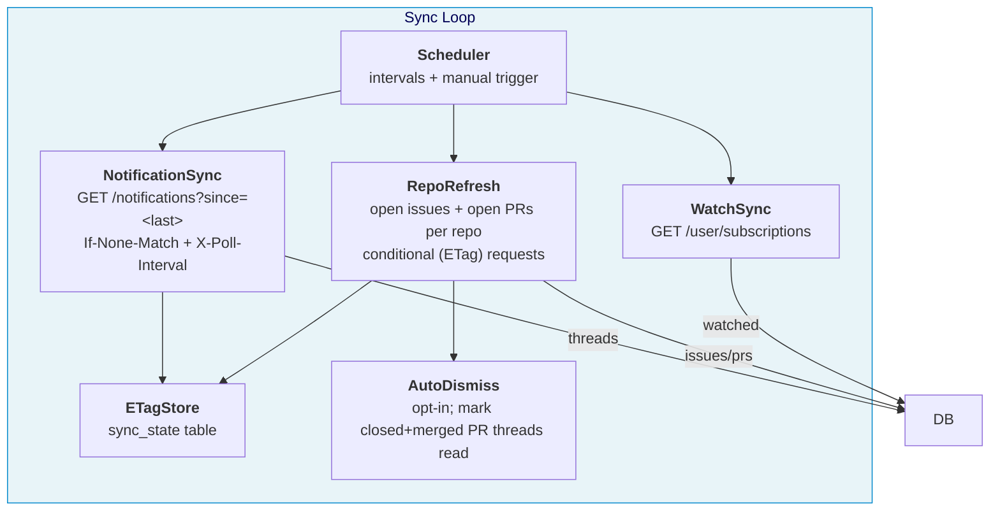
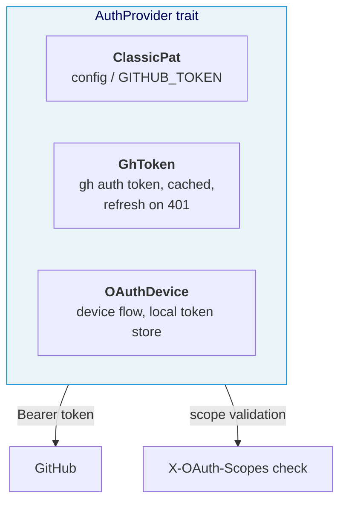
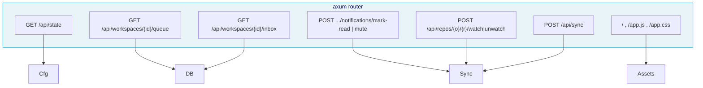

# Architecture (C4 Model)

## C1 — System Context

## C2 — Containers

## C3 — Components

### Sync Engine

### Auth Providers

### API Surface

## Notes

- The daemon and browser run on the same machine; all `/api/*` traffic is
  loopback-only by default (`127.0.0.1`). In a container the daemon binds
  `0.0.0.0:$PORT`.
- The GitHub API is the only external dependency; there are no databases or
  services beyond the local SQLite file.
- The UI is embedded at compile time (`rust-embed`), so the daemon binary is
  self-contained.